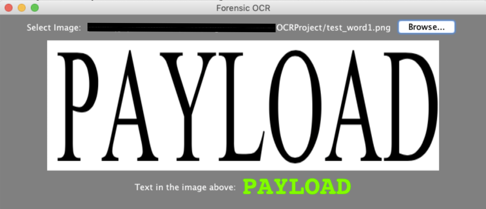
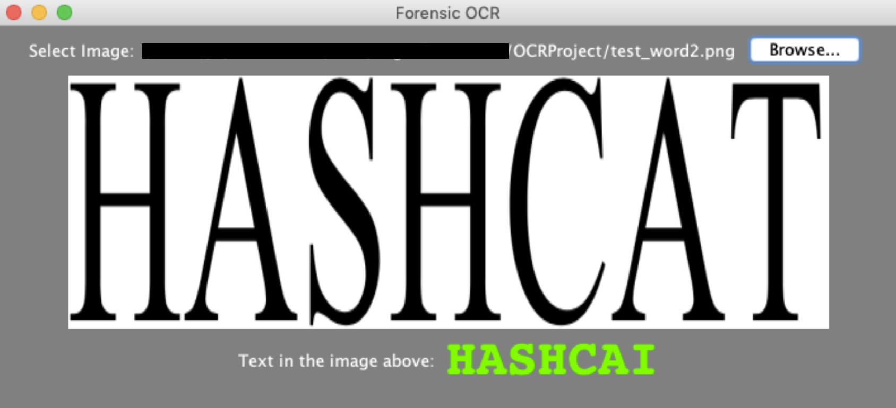

# Forensic Optical Character Recognition (OCR) Engine

---

Forensic OCR a rudimentary optical character recognition (OCR) engine that analyses image files and detects common characters.

---

## Why

Many existing tools used in forensic investigations focus on searching data in machine-encoded text. Data hidden within images, scans, and PDFs may be overlooked.

---

## How it works

The engine relies on a series of templates that represent the modern English alphabet. These templates are stored as two-dimensional binary arrays. The user then provides an image that it also converts into one or more two-dimensional binary arrays. It then compares each array with the template arrays by scoring. Each matching position between the same indices in both the input and template array gives that template a “point”. In the end, the template that has the most “points” is chosen and the engines best guess at the matching letter is stored and displayed. Adding more templates will allow the engine to detect more characters and improve accuracy.

---

## Challenges

The main challenges while developing the engine were trying to make it font-neutral, trying to use the best templates, allowing time for pre-processing, and trying to use high-quality images as input. This engine focuses primarily on Times New Roman uppercase modern English letters. Implementing pre-processing on the image with Image Magick also greatly improved the OCRs ability to detect words.

---

## Demo

